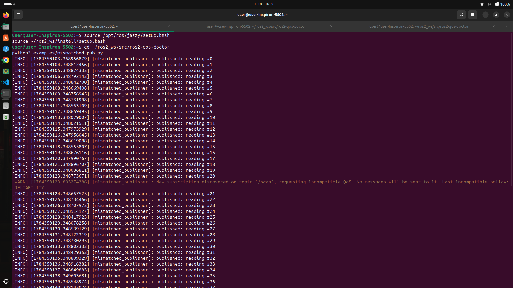
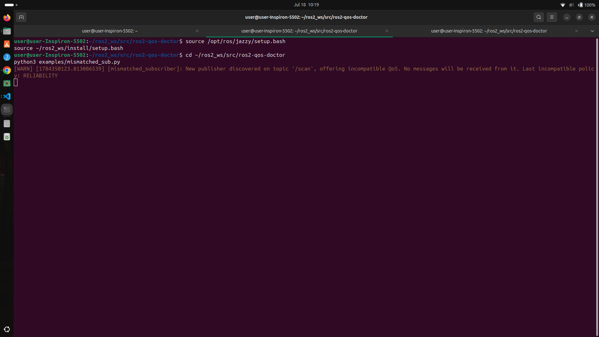
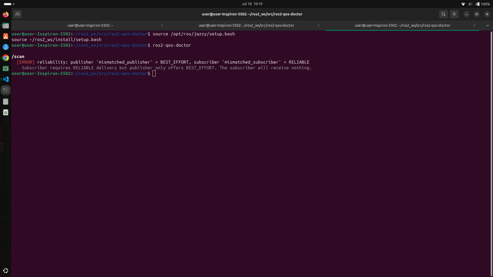

# ros2-qos-doctor

CLI that detects silent QoS mismatches between ROS 2 publishers and subscribers.


---

## Table of Contents

- [Why](#why)
- [Demo](#demo)
- [Install](#install)
- [Usage](#usage)
- [How It Works](#how-it-works)
- [Using It During Development](#using-it-during-development)
- [What It Checks](#what-it-checks)
- [Limitations](#limitations)
- [Roadmap](#roadmap)
- [Contributing](#contributing)
- [License](#license)

---

## Why

A topic can look perfectly healthy in `ros2 topic list`, while a subscriber callback never fires and nothing logs an error. Usually the cause is a QoS mismatch: the publisher and subscriber declared incompatible settings (reliability, durability, etc.), and DDS silently refuses to connect them.

`ros2-qos-doctor` scans a live ROS 2 graph, compares every publisher/subscriber pair on every topic, and reports incompatibilities in plain language, before they cost you an afternoon of debugging.

## Demo

A publisher and subscriber were set up on purpose with mismatched QoS, to show the tool catching the exact problem it's designed for.

**1. The publisher runs normally.** Partway through, DDS itself notices the subscriber wants incompatible settings:



**2. The subscriber never receives a single message**, it looks connected, but nothing arrives, and there's no error:



**3. `ros2-qos-doctor` explains exactly why:**



```
/scan
  [ERROR] reliability: publisher 'mismatched_publisher' = BEST_EFFORT, subscriber 'mismatched_subscriber' = RELIABLE
    Subscriber requires RELIABLE delivery but publisher only offers BEST_EFFORT. The subscriber will receive nothing.
```

Reproduce it yourself:

```bash
# terminal 1
python3 examples/mismatched_pub.py

# terminal 2
python3 examples/mismatched_sub.py

# terminal 3
ros2-qos-doctor
```

## Install

Requires a sourced ROS 2 install with `rclpy`. Developed and tested on Jazzy; should work on other recent distros (Humble, Kilted) since it only uses standard `rclpy` introspection APIs, but that hasn't been verified yet.

**As a colcon package:**

```bash
cd ~/ros2_ws/src
git clone https://github.com/Nihara-D/ros2-qos-doctor.git
cd ~/ros2_ws
colcon build
source install/setup.bash
```

**As a pip package:**

```bash
git clone https://github.com/Nihara-D/ros2-qos-doctor.git
cd ros2-qos-doctor
pip install -e .
```

## Usage

```bash
ros2-qos-doctor                 # scan every topic once
ros2-qos-doctor --topic /scan   # restrict to specific topic(s), repeatable
ros2-qos-doctor --watch         # continuously re-scan
ros2-qos-doctor --watch --interval 5
ros2-qos-doctor --no-color      # plain output, e.g. for CI logs
```

| Flag | Description |
|---|---|
| `--topic <name>` | Restrict the scan to one topic. Repeatable for multiple topics. |
| `--watch` | Keep re-scanning instead of running once. |
| `--interval <seconds>` | Seconds between scans in `--watch` mode. Default `3.0`. |
| `--no-color` | Disable ANSI colors. |

Exit code is `1` if a mismatch is found, `0` otherwise, safe to use in a pre-launch check or CI pipeline.

## How It Works

`ros2-qos-doctor` spins up a short-lived ROS 2 node and calls `get_publishers_info_by_topic` / `get_subscriptions_info_by_topic`, both already exposed by `rclpy`, to read the live QoS profile of every endpoint on every topic. Each publisher/subscriber pair is then checked against the standard DDS QoS compatibility rules, and any mismatch is reported with a plain-English explanation of the resulting behavior.

No extra middleware, no dependencies beyond `rclpy`, and no changes required to existing nodes.

## Using It During Development

| Situation | Command |
|---|---|
| Right after bringing your system up | `ros2-qos-doctor` |
| While actively coding and restarting nodes | `ros2-qos-doctor --watch` |
| Debugging a topic that "isn't working" | `ros2-qos-doctor --topic /suspicious_topic` |
| Before committing or opening a PR | `ros2-qos-doctor` |
| After integrating a third-party package | `ros2-qos-doctor` |

Run it the same way you'd run `ros2 topic list` or `ros2 topic echo`, a quick, habitual sanity check rather than a one-time test. Leaving `--watch` running in a spare terminal while developing catches a mismatch the moment it appears, and checking a suspicious topic first can save time before reaching for print statements or `rqt_graph`. Since the exit code reflects pass/fail, it also fits naturally into a pre-commit hook or CI job. Mismatched defaults between your code and a third-party package (a sensor driver, a nav stack component) are one of the most common sources of this problem, so it's worth a check right after adding one.

## What It Checks

| Policy | Rule | Severity |
|---|---|---|
| Reliability | `RELIABLE` subscriber + `BEST_EFFORT` publisher | ERROR |
| Durability | `TRANSIENT_LOCAL` subscriber + `VOLATILE` publisher | ERROR |
| Liveliness | Publisher and subscriber policies differ | WARNING |

## Limitations

- Only the policies above are checked; deadline and lifespan are not yet covered.
- Reads the QoS of nodes that are already running, it does not inspect nodes that haven't started, and does not statically parse launch files (see [Roadmap](#roadmap)).
- Only reports on topics with both a publisher and a subscriber present; a topic with only one side has nothing to compare.
- Diagnostic only, it identifies the mismatch but does not modify code or QoS settings for you.
- Verified on Jazzy. Should work on other recent distros (Humble, Kilted) since it only relies on standard `rclpy` APIs, but that hasn't been tested yet.

## Roadmap

- Deadline and lifespan policy checks
- A `--launch-file` mode for static analysis without a live system
- A ready-made GitHub Action for CI

## Contributing

Issues and PRs are welcome, particularly around the roadmap items above.

## License

Apache-2.0

---

Nihara Randini - shniharard@gmail.com
